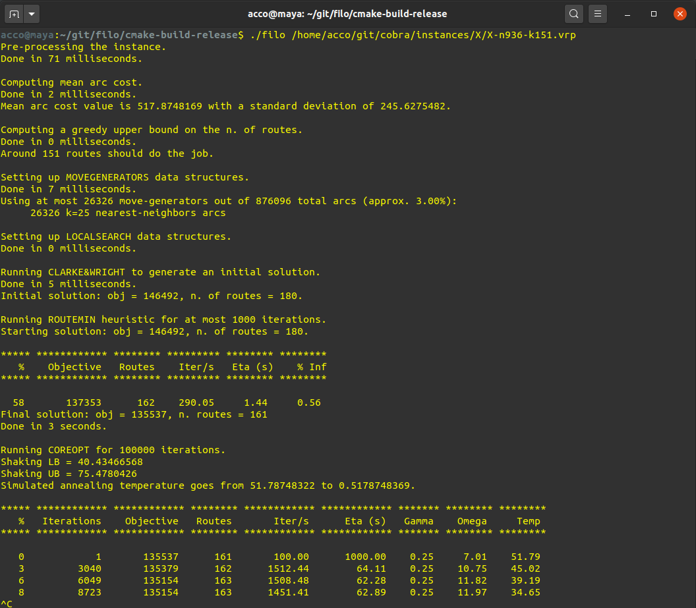
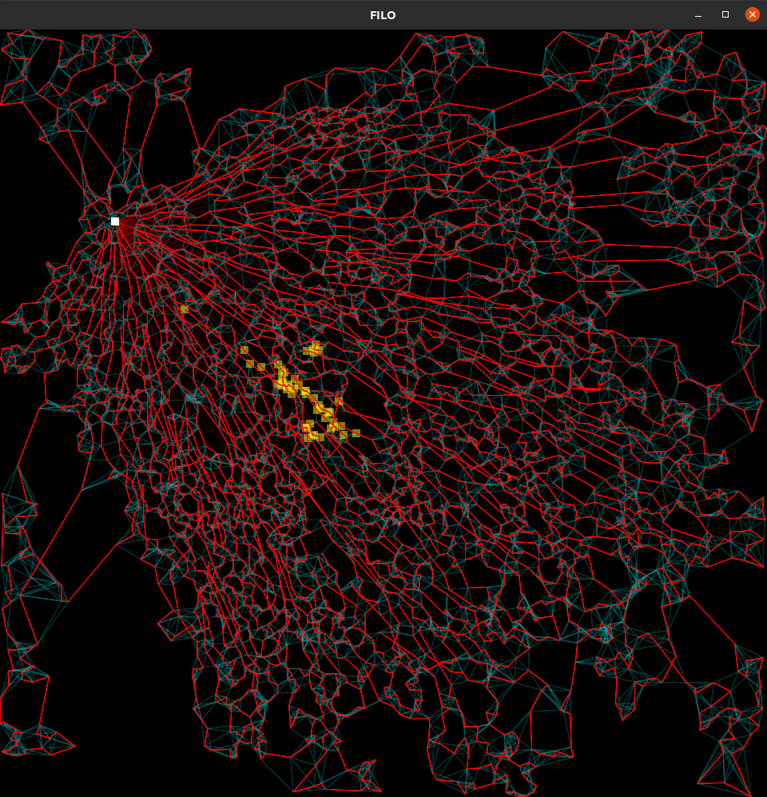
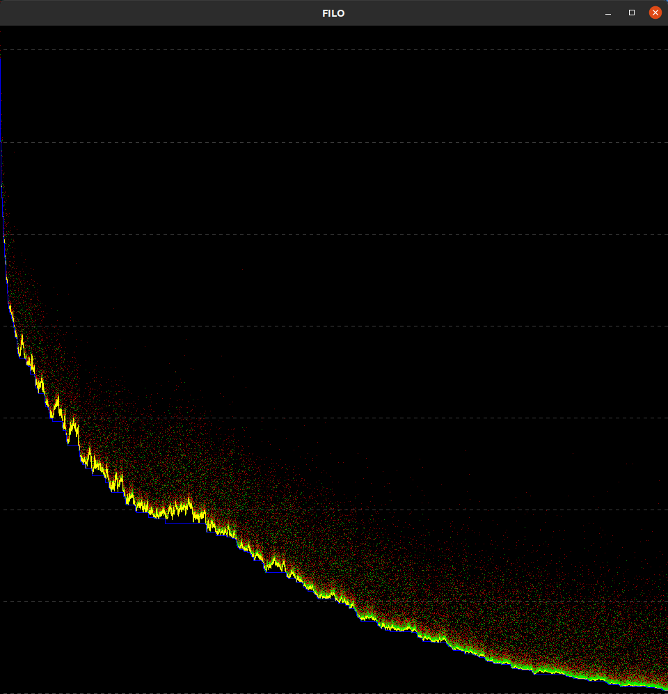

[This repository](https://github.com/acco93/filo) and [COBRA](https://github.com/acco93/cobra) contain source code and support material associated with the paper *A Fast and Scalable Heuristic for the Solution of Large-Scale Capacitated Vehicle Routing Problems*
- [Research report](https://github.com/acco93/filo/blob/master/docs/report.pdf)
- [Slides](https://github.com/acco93/filo/blob/master/docs/slides.pdf)
- [Paper](https://pubsonline.informs.org/doi/10.1287/trsc.2021.1059)

#### Building the code

1. Build and install the [COBRA](https://github.com/acco93/cobra) library

2. Clone the repository and build the algorithm

```
  git clone https://github.com/acco93/filo.git
  cd filo
  mkdir build && cd build
  cmake .. -DCMAKE_BUILD_TYPE=Release -DENABLE_VERBOSE=ON
  make -j
```

#### Build options

The are a number of build options that are disabled by default.
In order to enable an option `XYZ`, add `-DXYZ=ON` to the `cmake` command before calling `make`

Available options

* `ENABLE_VERBOSE` output some information during the resolution.
* `ENABLE_GUI` creates a GLFW window showing a graphical representation of the best found solution along with some information regarding move generators and recently accessed vertices, and another GLFW window showing the algorithm search trajectory. Some additional packages, e.g. `libglfw3-dev`, may be necessary to compile the code when this option is enabled.
* `TIMEBASED_TERMINATION` allows you to specify a termination criterion based on a maximum number of seconds.

#### Running the code

Once `filo` has been built, you can run it by giving as first mandatory argument the path to a compatible instance file.

As an example, if the executable is in the `build` directory and both `cobra` and `filo` projects are into a `git` directory in the `user` home

```
cd /home/user/git/filo/build

./filo /home/user/git/cobra/instances/X/X-n936-k151.vrp
```

An help menu explaining available optional command line arguments can be read by executing `filo --help`.

More examples on how to run the code can be found in the [`scripts`](https://github.com/acco93/filo/tree/master/scripts) directory.

#### How can I exactly reproduce the results shown in the [`results`](https://github.com/acco93/filo/tree/master/results) directory?

1. Drop me an email and I will send you a link you can use to donwload a copy of the Ubuntu environment we used to run the code
2. Unzip `env.tar.zip` to obtain `env.tar`
3. `docker image load -i env.tar`
3. `docker run -t -i filo:20200804 /bin/bash`
4. Executable and instances can be found in `/data`

Note that `filo` executed within docker will not be as fast as `filo` executed on the native OS, however, this is the safest way if you want to check our results. For any other reason, consider using a native build.

#### Screenshots

Console output (`ENABLE_VERBOSE=ON`). ROUTEMIN: % Inf = n. infeasible solution over number of performed iterations. COREOPT: Gamma = average sparsification factor, Omega = average shaking intensity.


Solution representation (`ENABLE_GUI=ON`). Routes are shown in green-to-red shades, the redder the loaded.
Move generators are shown in cyan. The current area in which filo is working is identified by the yellow squares.


Search trajectory (`ENABLE_GUI=ON`). The best solution value is represented by the blue line while the current solution value by the yellow line. Red and green dots represent the value of the shaken solution and the re-optimized local optima respectively. Each horizontal dashed line identifies a 1% improvement of the gap with respect to the initial solution value.

